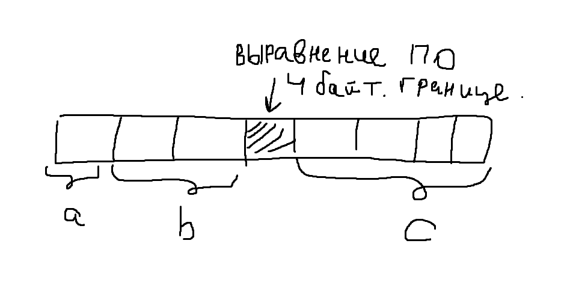

## Про структуры

```c++
typedef struct {
    uint8_t a;
    uint16_t b;
} Test;

Test test;
printf("%d", sizeof(test));
```

Казалось бы, вывод должен напечатать 3: `a` занимает 1 байт и `b` два байта.
Но вывод будет равен 4. Все дело в выравнивании байты выравниваются по 2 байтовой границе
и после `a` добавится еще один байт

```c++
typedef struct {
    uint8_t a;
    uint16_t b;
    uint32_t с;
} Test;
```

Тут будет размер 8 байт


