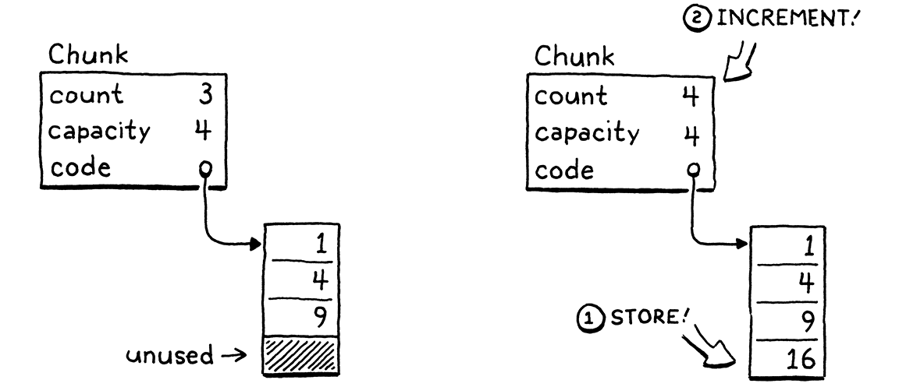
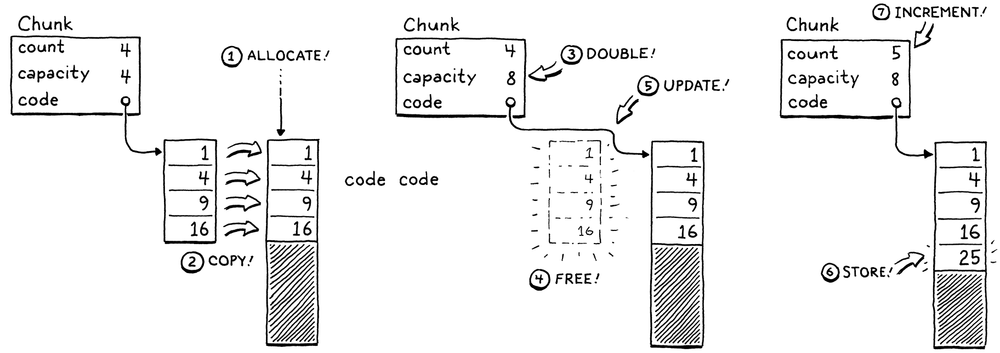
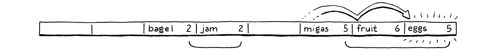
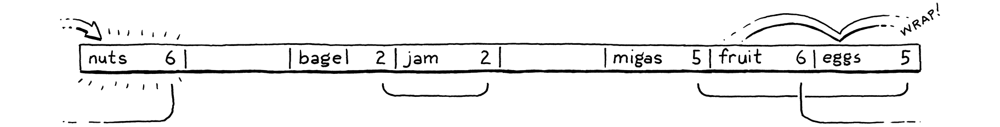
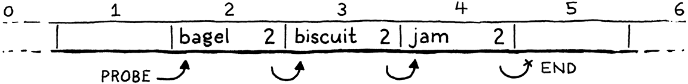
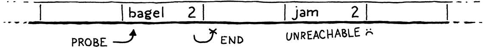
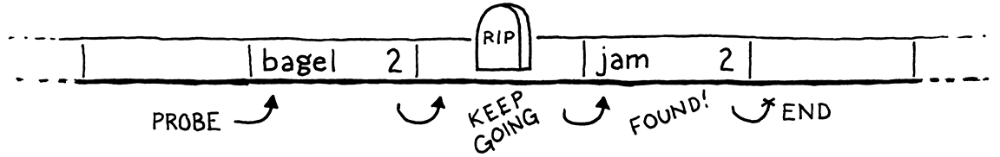

<!-- TOC -->
  * [Динамический массив](#динамический-массив)
    * [Chunk](#chunk)
      * [Интерфейс взаимодействия](#интерфейс-взаимодействия)
    * [ValueArray](#valuearray)
  * [Хеш таблица](#хеш-таблица)
    * [Поиск элемента](#поиск-элемента)
    * [Увеличение массива и перераспределение](#увеличение-массива-и-перераспределение)
    * [Добавление](#добавление)
    * [Получение](#получение)
    * [Удаление](#удаление)
<!-- TOC -->

## Динамический массив




Увеличение вместительности
```c++
#define GROW_CAPACITY(capacity) \
    ((capacity) < 8 ? 8 : (capacity) * 2)
```
Выделение новой области памяти или увеличение существующей
```c++
#define GROW_ARRAY(type, pointer, oldCount, newCount) \
    (type*)reallocate(pointer, sizeof(type) * (oldCount), sizeof(type) * (newCount))
```
Очистка выделенной области памяти
```c++
#define FREE_ARRAY(type, pointer, oldCount) \
    reallocate(pointer, sizeof(type) * oldCount, 0)
```
Выделение новой области памяти
```c++
#define ALLOCATE(type, count) \
    (type*)reallocate(NULL, 0, sizeof(type) * (count))
```

### Chunk
Последовательность байт-код инструкций, которые последовательно исполняет интерпретатор.

```c++
typedef enum {
    OP_CONSTANT,
    OP_NIL,
    OP_TRUE,
    OP_FALSE,
    OP_EQUAL,
    OP_GREATER,
    OP_LESS,
    OP_ADD,
    OP_SUBTRACT,
    OP_MULTIPLY,
    OP_DIVIDE,
    OP_NOT,
    OP_NEGATE,
    OP_PRINT,
    OP_POP,
    OP_DEFINE_GLOBAL,
    OP_GET_GLOBAL,
    OP_SET_GLOBAL,
    OP_GET_LOCAL,
    OP_SET_LOCAL,
    OP_RETURN,
} OpCode;

typedef struct {
    int count; // количество живых элементов
    int capacity; // вместимость
    uint8_t* code; // указатель на начало массива байт код инструкций
    int* lines; // указатель на начало массива номеров строк
    ValueArray constants; // пул констант
} Chunk;
```

#### Интерфейс взаимодействия

Инициализация чанка
```c++
void initChunk(Chunk *chunk) {
    chunk->count = 0;
    chunk->capacity = 0;
    chunk->code = NULL;
    chunk->lines = NULL;
    initValueArray(&chunk->constants);
}
```
Очистка чанка
```c++
void freeChunk(Chunk *chunk) {
    FREE_ARRAY(uint8_t, chunk->code, chunk->capacity);
    FREE_ARRAY(int, chunk->lines, chunk->capacity);
    freeValueArray(&chunk->constants);
    initChunk(chunk);
}
```
Добавление значения
```c++
void writeChunk(Chunk *chunk, uint8_t byte, int line) {
    if (chunk->capacity < chunk->count + 1) {
        int oldCapacity = chunk->capacity;
        chunk->capacity = GROW_CAPACITY(oldCapacity);
        chunk->code = GROW_ARRAY(uint8_t, chunk->code, oldCapacity, chunk->capacity);
        chunk->lines = GROW_ARRAY(int, chunk->lines, oldCapacity, chunk->capacity);
    }

    chunk->code[chunk->count] = byte;
    chunk->lines[chunk->count] = line;
    chunk->count++;
}
```
Добавление значения в пул констант. Возвращается индекс добавленной константы
```c++
int addConstant(Chunk *chunk, Value value) {
    writeValueArray(&chunk->constants, value);
    return chunk->constants.count - 1;
}
```

### ValueArray
Интерфейс взаимодействия аналогичен Chunk.
```c++
typedef struct {
    int capacity;
    int count;
    Value* values;
} ValueArray;
```

## Хеш таблица
Реализация алгоритма open addressing 





Хеш таблица представляет динамический массив из объектов Entry, где ключ - ObjString* и значение Value.
```c++
#define TABLE_MAX_LOAD 0.75

typedef struct {
    ObjString* key;
    Value value;
} Entry;

typedef struct {
    int count;
    int capacity;
    Entry* entries;
} Table;

void initTable(Table *table) {
    table->count = 0;
    table->capacity = 0;
    table->entries = NULL;
}

void freeTable(Table *table) {
    FREE_ARRAY(Entry, table->entries, table->capacity);
    initTable(table);
}
```

### Поиск элемента

Для поиска элемента высчитывается индекс массива из хеша, далее проверяется у найденного элемента `entry->key == NULL`. Может быть два случая:
1. `entry->value == NULL`. Значит, что запрашиваемый элемент не был найден, в таком случае возвращается первый найденный tombstone, если такой был иначе сам entry.
2. `entry->value != NULL`. Значит, что это tombstone. Мы сохраняем первого встреченного в переменную, чтобы вернуть в случае если не будет найден элемент.

```c++
static Entry* findEntry(Entry* entries, int capacity, ObjString* key) {
    uint32_t index = key->hash % capacity;
    Entry* tombstone = NULL;

    for (;;) {
        Entry* entry = &entries[index];
        if (entry->key == NULL) {
            if (IS_NIL(entry->value)) {
                return tombstone != NULL ? tombstone : entry;
            }

            if (tombstone == NULL) tombstone = entry;
        } else if (entry->key == key) {
            return entry;
        }

        index = (index + 1) % capacity;
    }
}
```

### Увеличение массива и перераспределение

Когда объем превышает допустмый размер, тогда выделяется новый (НЕ увеличивается старый) увеличенный динамический массив и просиходит
копирование старых элементов на новые места, за исключением tombstone'ов. Старый массив очищается.
```c++
static void adjustCapacity(Table* table, int capacity) {
    Entry* entries = ALLOCATE(Entry, capacity);
    for (int i = 0; i < capacity; i++) {
        entries[i].key = NULL;
        entries[i].value = NIL_VAL;
    }

    table->count = 0;
    for (int i = 0; i < table->capacity; i++) {
        Entry* entry = &table->entries[i];
        if (entry->key == NULL) continue;

        Entry* dest = findEntry(entries, capacity, entry->key); // ищем новую корзину для старого ключа
        dest->key = entry->key;
        dest->value = entry->value;
        table->count++;
    }

    FREE_ARRAY(Entry, table->entries, table->capacity);
    table->entries = entries;
    table->capacity = capacity;
}
```

### Добавление

Сначала проверяется не будет ли новый размер превышать порог после добавления элемента.
Ищется элемент: если и ключ и значение NULL, тогда делается увеличение счетчика элементов, поскольку tombstone тоже считается
элементом.
```c++
bool tableSet(Table *table, ObjString *key, Value value) {
    if (table->count + 1 > table->capacity * TABLE_MAX_LOAD) {
        int capacity = GROW_CAPACITY(table->capacity);
        adjustCapacity(table, capacity);
    }

    Entry* entry = findEntry(table->entries, table->capacity, key);
    bool isNewKey = entry->key == NULL;
    if (isNewKey && IS_NIL(entry->value)) table->count++;

    entry->key = key;
    entry->value = value;
    return isNewKey;
}
```

### Получение

Возвращается true если был найден живой элемент, его значение копируется в переданный указатель 
и false если найден tombstone или пустой элемент.
```c++
bool tableGet(Table *table, ObjString *key, Value *value) {
    if (table->count == 0) return false;

    Entry* entry = findEntry(table->entries, table->capacity, key);
    if (entry->key == NULL) return false;

    *value = entry->value;
    return true;
}
```

### Удаление




Для удаления используется tombstone (key=NULL, value=true) для того чтобы не сломать логику поиска.
Если был удален элемент после которого есть еще какие-то, то поиск остановится и вернет пустой элемент.
```c++
bool tableDelete(Table *table, ObjString *key) {
    if (table->count == 0) return false;

    Entry* entry = findEntry(table->entries, table->capacity, key);
    if (entry->key == NULL) return false;

    entry->key = NULL;
    entry->value = BOOL_VAL(true);
    return true;
}
```